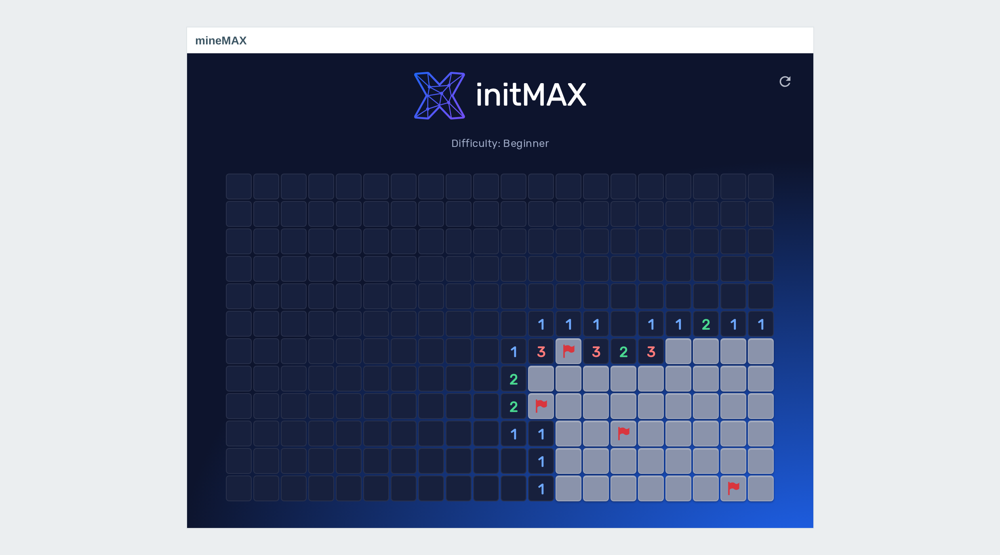
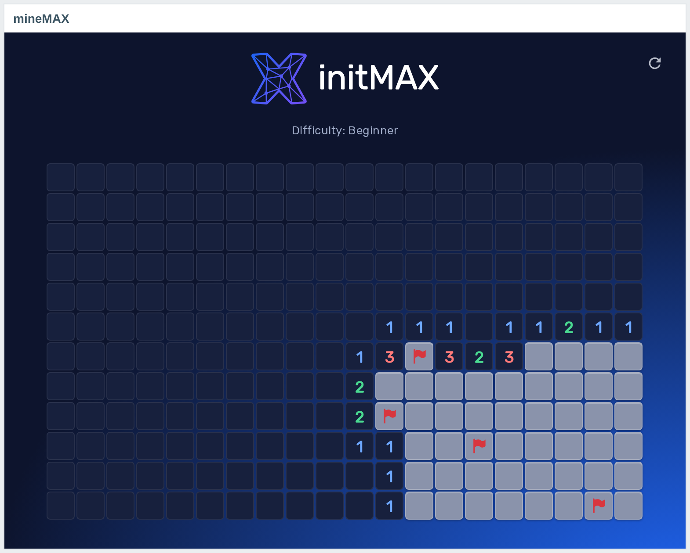
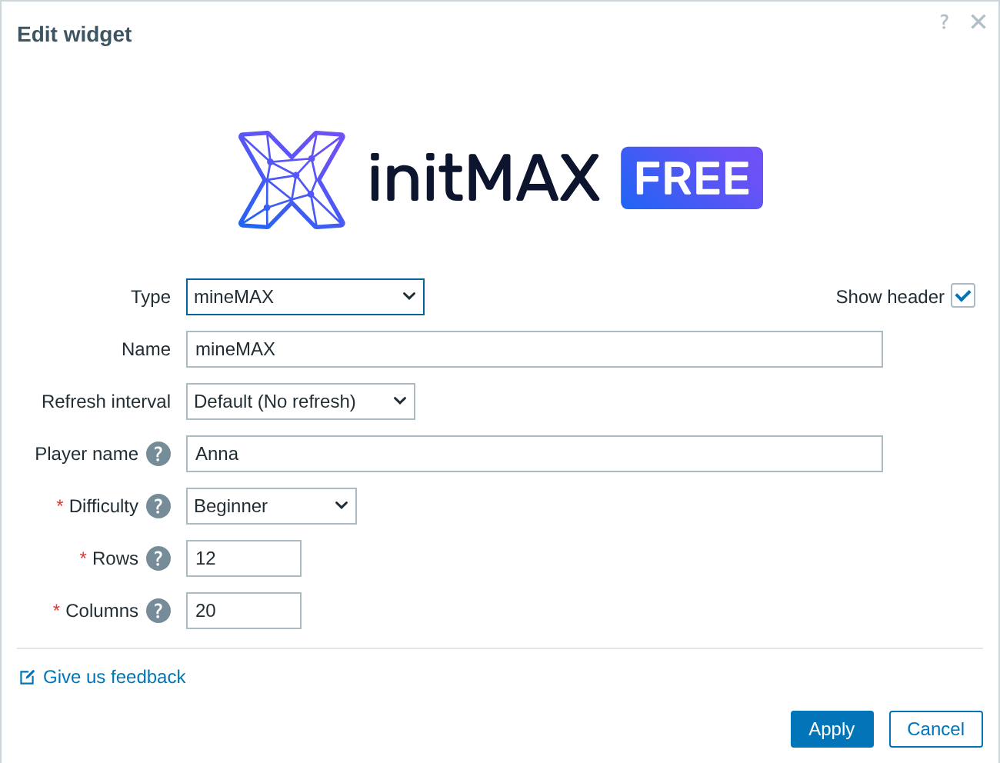
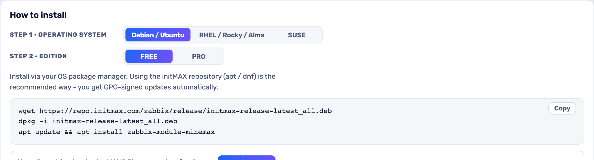

<h1>mineMAX</h1>

developed and maintained by

and community

<strong>Minesweeper, on your Zabbix dashboard.</strong> 
For the quiet shifts. Free, like the rest of our small stuff - and a good excuse to show someone how a Zabbix module is put together.

<a href="#what-you-can-build"><strong>Features</strong></a> &nbsp;·&nbsp;
<a href="#examples"><strong>Examples</strong></a> &nbsp;·&nbsp;
<a href="#install"><strong>Install</strong></a> &nbsp;·&nbsp;
<a href="#free-vs-pro"><strong>FREE vs PRO</strong></a> &nbsp;·&nbsp;
<a href="https://portal.initmax.com"><strong>Portal</strong></a> &nbsp;·&nbsp;
<a href="https://www.initmax.com/wiki/minemax-game/"><strong>Docs</strong></a>

 

---

## Why mineMAX

It is Minesweeper. Add the widget, put in your name, pick a difficulty and a board size, and play - left click to reveal, right click to flag, the arrow in the corner starts a new game.

Nothing about it touches your monitoring: it reads no items, stores no data and talks to no server. It is a dashboard widget that happens to be a game.

## What you can build

<table>
<tr>
<td width="50%" valign="top">

**Minesweeper on the dashboard**

Three difficulties and an adjustable board size - a break that does not leave Zabbix.

</td>
<td width="50%" valign="top">

**Name on the board**

Show the player's name so the leaderboard at the office desk stays honest.

</td>
</tr>
<tr>
<td width="50%" valign="top">

**Runs in the browser only**

Reads no items and stores nothing; the widget is pure JavaScript.

</td>
</tr>
</table>

## Examples

<table>
<tr>
<td width="50%" align="center" valign="top"> <small><b>Board</b> - board</small></td>
</tr>
</table>

## Configuration

Everything lives in one familiar widget form.

## Install

**FREE** ships as **GPG-signed `deb` / `rpm` packages** from the initMAX repository - `apt` / `dnf` installs them and keeps them updated.

### Easiest way - the guided installer on the Portal

Open the product page, pick your **OS** and **edition**, and copy the ready-made command. FREE is fully public (no login); PRO fills in your token once you sign in. There's a feedback box right there too.

<a href="https://portal.initmax.com/catalog/zabbix-minemax#how-to-install"><strong>→ Open the installer on the Portal</strong></a>

Prefer a plain archive? Every release also ships as a **ZIP** [straight from the repo](https://repo.initmax.com/zabbix/free/zip/minemax/) - handy for offline or manual installs.

The module is enabled automatically during the package installation - verify it in **Administration → General → Modules**. Done.

## FREE vs PRO

There is no paid edition - everything below is in the one package.

| Feature | FREE |
| ---------------------------------------------------------- | :----: |
| Minesweeper on the dashboard - three difficulties, adjustable board size | ✅ |
| Player name on the board | ✅ |
| Runs entirely in the browser - reads no items, stores nothing | ✅ |
| Localised into all 25 Zabbix display languages | ✅ |
| High availability ready | ✅ |
| Licence | AGPLv3 |

## Requirements

|              |                                                              |
| ------------ | ------------------------------------------------------------ |
| **Zabbix**   | 6.0 · 6.2 · 6.4 · 7.0 · 7.2 · 7.4 - one package covers all    |
| **PHP**      | 7.4 or newer                                                 |
| **OS**       | Debian/Ubuntu · RHEL/Rocky/Alma/Oracle/Amazon · SUSE         |
| **Editions** | FREE (public repo) - there is no paid edition                  |
| **Languages** | All 25 Zabbix display languages - the widget follows each user's own language setting |
| **High availability** | Ready. No server-side component and no local state - the game lives in the browser; install it on every frontend node of an HA cluster and any node can serve it |

### On the older Zabbix line

One package covers all six versions. Zabbix 6.0 and 6.2 register widgets in a different way than 6.4 and later, so the package carries a second module tree for them - the installer picks the right one for the frontend it finds, and a Zabbix upgrade switches it over without reinstalling the widget or touching its configuration.

Nothing is left out down there. Same four settings, in the same order, with the same labels; the same board, the same colours and the same font; left click, right click and the new-game arrow all behave the same. There is no version note to write for this one, because there is nothing this widget can do on 7.4 that it cannot do on 6.0.

## Support &amp; links

- **[Documentation / Wiki](https://www.initmax.com/wiki/minemax-game/)**
- **[Product page](https://www.initmax.com/product/minemax-game/)**
- **[Portal](https://portal.initmax.com)** - downloads, tokens, support tickets
- **Source code (FREE, AGPLv3)** - included in every package and published as a [source archive](https://repo.initmax.com/zabbix/free/zip/minemax/) on repo.initmax.com
- **[support@initmax.com](mailto:support@initmax.com)**

---

FREE: <a href="https://www.gnu.org/licenses/agpl-3.0.html">AGPLv3</a> &nbsp;·&nbsp; © 2021–2026 initMAX s.r.o.

